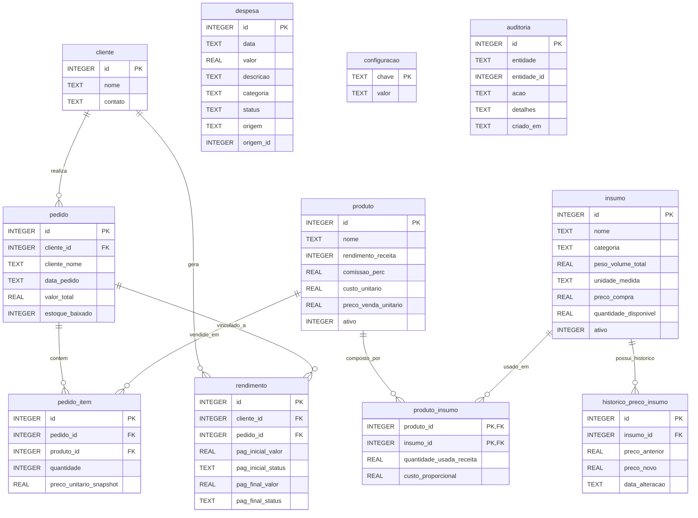

# Diagrama Entidade Relacionamento (DER)

Abaixo está o Diagrama de Entidade-Relacionamento do banco de dados do sistema Doce Neves, cobrindo as 11 tabelas presentes no schema SQLite.

```mermaid
erDiagram
    cliente ||--o{ pedido : "realiza"
    cliente ||--o{ rendimento : "gera"
    
    pedido ||--o{ pedido_item : "contem"
    pedido ||--o{ rendimento : "vinculado_a"
    
    produto ||--o{ pedido_item : "vendido_em"
    produto ||--o{ produto_insumo : "composto_por"
    
    insumo ||--o{ produto_insumo : "usado_em"
    insumo ||--o{ historico_preco_insumo : "possui_historico"
    
    despesa {
        INTEGER id PK
        TEXT data
        REAL valor
        TEXT descricao
        TEXT categoria
        TEXT status
        TEXT origem
        INTEGER origem_id
    }
    
    configuracao {
        TEXT chave PK
        TEXT valor
    }
    
    auditoria {
        INTEGER id PK
        TEXT entidade
        INTEGER entidade_id
        TEXT acao
        TEXT detalhes
        TEXT criado_em
    }
    
    cliente {
        INTEGER id PK
        TEXT nome
        TEXT contato
    }
    
    pedido {
        INTEGER id PK
        INTEGER cliente_id FK
        TEXT cliente_nome
        TEXT data_pedido
        REAL valor_total
        INTEGER estoque_baixado
    }
    
    pedido_item {
        INTEGER id PK
        INTEGER pedido_id FK
        INTEGER produto_id FK
        INTEGER quantidade
        REAL preco_unitario_snapshot
    }
    
    produto {
        INTEGER id PK
        TEXT nome
        INTEGER rendimento_receita
        REAL comissao_perc
        REAL custo_unitario
        REAL preco_venda_unitario
        INTEGER ativo
    }
    
    insumo {
        INTEGER id PK
        TEXT nome
        TEXT categoria
        REAL peso_volume_total
        TEXT unidade_medida
        REAL preco_compra
        REAL quantidade_disponivel
        INTEGER ativo
    }
    
    produto_insumo {
        INTEGER produto_id PK,FK
        INTEGER insumo_id PK,FK
        REAL quantidade_usada_receita
        REAL custo_proporcional
    }
    
    historico_preco_insumo {
        INTEGER id PK
        INTEGER insumo_id FK
        REAL preco_anterior
        REAL preco_novo
        TEXT data_alteracao
    }
    
    rendimento {
        INTEGER id PK
        INTEGER cliente_id FK
        INTEGER pedido_id FK
        REAL pag_inicial_valor
        TEXT pag_inicial_status
        REAL pag_final_valor
        TEXT pag_final_status
    }
```
